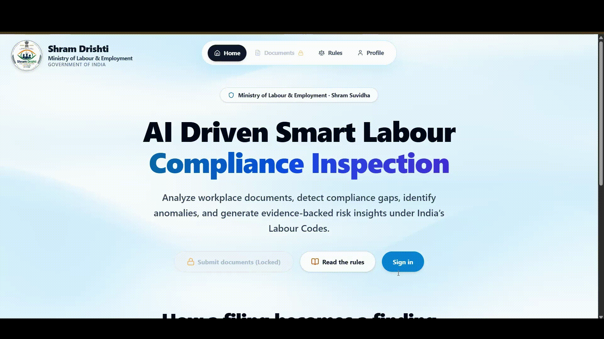
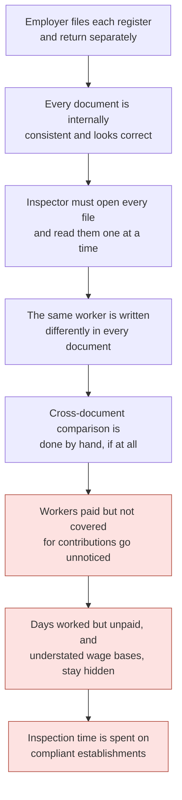
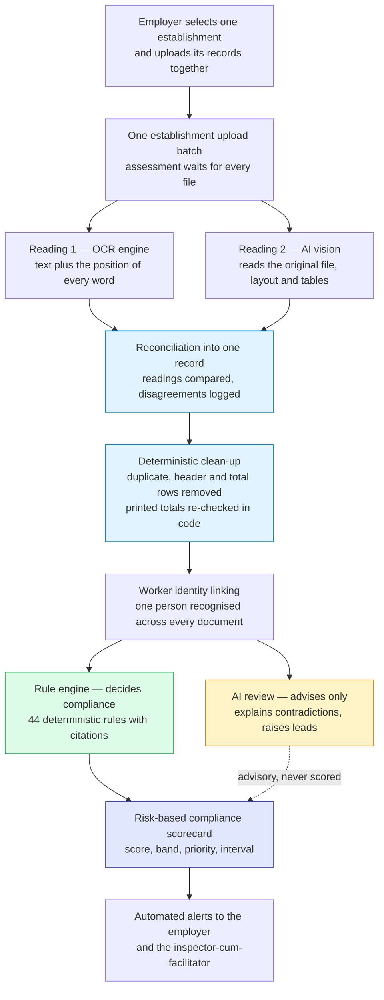
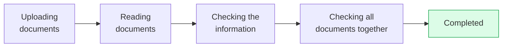
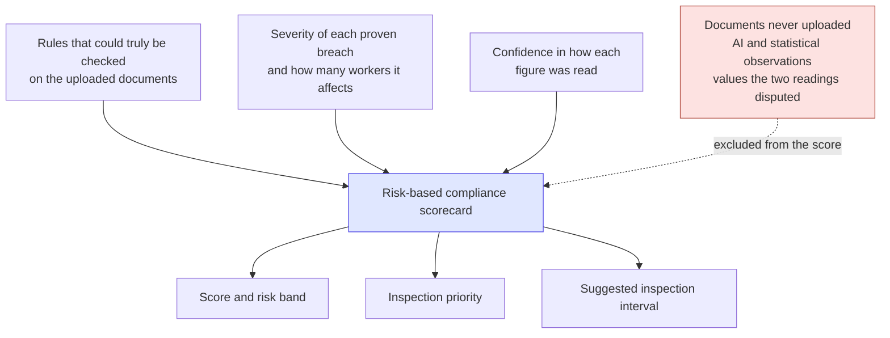

# Shram Drishti

**An AI-driven smart inspection system for labour code compliance.**

Shram Drishti reads the registers and returns an employer actually files, links them together as a single body of evidence, checks them against India's four Labour Codes, and produces a risk-based compliance scorecard that an inspector can defend and an employer can understand.

I built this for **Digital Shram Sankalp — Reimagining India's Labour Ecosystem with AI**, against problem statement **PS-5, AI-Driven Smart Inspection System for Labour Code Compliance for Shram Suvidha Portal**.

---

## Try it

| | |
|:---|:---|
| **Live application** | **https://shram-drishti.vercel.app/** |
| **Source code** | https://github.com/23110572-hash/Shram-Drishti |
| **Email** | `admin@gmail.com` |
| **Password** | `12345` |

The first request may take a few seconds while the service wakes up.

---

## Demo

---

## The problem

The problem statement asks a direct question:

> How can AI-enabled technologies and automated document-reading tools be utilised to enable intelligent document (PDFs, Scanned pdf/ image, Images) analysis, interpret compliances requirements under new labour codes, automatically flags anomalies, discrepancies, missing fields or non-compliance etc. and send automated alerts to employers and inspectors-cum-facilitator. Solution should also be able to generate a risk-based compliance scorecard for establishments.

India consolidated twenty-nine labour laws into four Codes: the Code on Wages 2019, the Industrial Relations Code 2020, the Code on Social Security 2020, and the Occupational Safety, Health and Working Conditions Code 2020. Together with their Central Rules, these decide how millions of establishments must pay, record and protect their workers.

Compliance is proven with paper. An employer files an employee register, a wage register, a muster roll, wage slips, provident fund and insurance returns, licences, appointment letters and accident records. Each document is filed separately, and read on its own, each one almost always looks correct.

That is exactly where the real violation hides.

A wage register can be internally perfect while the provident fund return quietly covers fewer workers than the register pays. An attendance record can show days worked that the wage register never paid for. A contribution challan can be computed on a wage base lower than the register itself states. No single page is wrong. The breach exists only in the space between the documents.

So the real problem was never "read a PDF". It was five harder things at once: documents arrive as clean PDFs, scans and phone photographs; the same worker is written differently in every one of them; obligations depend on headcount, sector and hazard, so applicability must be settled before anything is judged; the serious violations live only in the comparison; and an inspector's time is the scarcest resource in the system, so the output has to be evidence rather than guesswork.

---

## What I built

I built a system that treats every document uploaded for one establishment and one period as a single interconnected body of evidence, never as separate files.

An employer selects their establishment, drops in whatever records they have, and Shram Drishti reads every document twice through two independent engines, reconciles the two readings, links the same worker across all of them, applies deterministic Labour Code rules that carry real statutory citations, reports what it has proven in plain language, generates a risk-based compliance scorecard, and notifies both the employer and the inspector-cum-facilitator.

Every figure traces back to the page it was read from.

---

## How the system is put together

The most important line in that diagram is the one between the rule engine and the AI review. Everything on the rule side is reproducible and citable. Everything on the AI side is advisory and can never change a verdict or a number.

---

## One upload becomes one assessment

When an employer submits their documents, I create a single durable upload batch. Every file is attached to it, and the assessment holds at a barrier until every document in that batch has finished being read.

This matters far more than it sounds. Without the barrier, the wage register finishes first, an assessment runs on it alone, and the employer is told that workers are missing from provident fund coverage before the contribution return has even been opened. One batch means one honest result.

The employer sees a single progress card for the establishment, never one card per file.

---

## Every document is read twice

This is the part I care about most, because extraction accuracy decides everything downstream. A wrong figure here does not stay a wrong figure. It becomes a legal accusation against a real employer.

So each document is read by two engines that do not see each other's work. An OCR engine reads the pages and returns text along with the position of every word, which later becomes the coordinates that prove where a figure came from. Separately, an AI vision model reads the original document and interprets its layout, its wide tables and its column headings, which is what makes messy scans and handwriting workable. A third pass then reconciles the two readings into one strict record and logs every place they disagreed.

Two readings catch what one cannot. Registers routinely repeat their column headings on every page, print a total row at the foot of the table, and carry a worker across a page break. Any one of those can be transcribed as a person who does not exist, and a single phantom worker is enough to make the headcount disagree with every other document, which then reads as an employer concealing staff.

If the two readings still disagree, the value is not guessed. It is recorded as needing confirmation and kept out of legal judgement entirely.

I deliberately refused one shortcut here. An earlier version took the highest worker count it had seen across all sources, which meant a single noisy scan could permanently raise an establishment's headcount and switch on obligations that never applied to it. Now the counts observed in documents are reported beside the result, and the employer's declared profile is never silently overwritten by one uncertain reading.

---

## Linking the documents into one picture

Workers are matched across documents using employee code, universal account number, insurance number and name, so the same person appearing in four different layouts becomes one worker rather than four.

That linking is what makes the genuinely useful checks possible. Is everyone in payroll present in the contribution return? Do the days paid match the days recorded as present? Were overtime hours recorded but never paid? Is the contribution wage base lower than the wages the register itself states? Do the headcounts across registers and returns agree with each other?

None of those questions can be answered from one document. All of them can be answered once the documents are linked.

---

## The law decides compliance, not the model

Every legal conclusion comes from a deterministic rule pack that I wrote directly from the official Code and Central Rules text, not from a language model's opinion.

There are **44 executable rules** across the four Codes. Each one carries the exact section or rule it comes from, who it applies to including headcount thresholds, the evidence it needs before it may run at all, a reproducible test, a plain English explanation, and both a passing and a failing fixture so a rule written backwards cannot ship. Every rule is validated automatically: **44 rules, 100 fixtures, zero errors**.

Writing rules from the source text also meant deleting rules I had already built, when the official wording did not support them.

| What I removed or corrected | Why |
|:---|:---|
| A works committee obligation triggered purely on headcount | The Code makes the obligation follow a government order, not a number alone |
| A thirty-day grievance decision deadline | The provision says the committee may complete proceedings in that time, not that it must |
| A twelve-hour daily working cap | Replaced with the eight-hour normal working day the Rules actually state |
| Six separate appointment-letter findings | Consolidated into one, because six near-identical rows is noise rather than insight |
| Minimum wage enforcement | Kept advisory, because the operative rates come from state notifications rather than the Code |

A rule that accuses a compliant employer is worse than no rule at all.

---

## Where the AI stops

I use AI aggressively, but never as the judge.

| AI does this | AI never does this |
|:---|:---|
| Reads PDFs, scanned pages and photographs | Decides whether the law was broken |
| Understands messy headings and rebuilds tables | Counts the final number of workers |
| Maps differently named columns onto one schema | Performs the arithmetic |
| Explains contradictions in simple English | Chooses a statutory threshold |
| Raises leads the rules were never written for | Changes a severity or moves the score |
| Summarises all the documents together | Overwrites an establishment's declared profile |

Model observations appear as advisory notes and are structurally excluded from scoring. A compliance finding needs a citation and a repeatable test, and an opinion has neither.

---

## Findings an employer can act on

Every finding records the document, the page and the exact cell it came from, along with the figures that were compared and the provision relied on. Problems are shown as a simple numbered list in ordinary language, so an employer who has never read a Labour Code still understands what was found in their own records.

---

## The risk-based compliance scorecard

The score answers one question: based on the records that were actually submitted, how much risk is visible here?

A critical breach caps the overall score, so it can never be averaged away by clean areas. The scorecard is clearly labelled as covering the uploaded records, and it produces an inspection priority and interval so a compliant employer is left alone while an officer's time goes where the risk actually is.

Scorecards are immutable. An establishment's trajectory over time is therefore real history rather than a number that was quietly restated.

---

## Automated alerts

Once an assessment completes, the employer receives a notice describing what was found and what it rests on, and the inspector-cum-facilitator receives the risk picture and priority. Only the findings that contributed to the current result are used, so nobody is chased over something stale.

---

## How this project answers the problem statement

| What PS-5 asks for | How Shram Drishti delivers it |
|:---|:---|
| Intelligent analysis of PDFs, scanned PDFs and images | Every document is read twice, by an OCR engine and an AI vision model, then reconciled into one record |
| Interpret compliance requirements under the new labour codes | 44 deterministic rules written from the official Code and Central Rules text, each carrying its exact citation and applicability threshold |
| Automatically flag anomalies and discrepancies | Cross-document checks compare payroll, attendance and contribution records against each other and report where they disagree |
| Automatically flag missing fields | Prescribed particulars are checked inside the documents that were uploaded, and blank statutory fields are reported |
| Automatically flag non-compliance | Deterministic verdicts with a document, page and cell reference for every finding |
| Send automated alerts to employers | Plain-language notice of what was found and what it rests on, issued as soon as an assessment completes |
| Send automated alerts to inspectors-cum-facilitators | Risk picture, priority and evidence-backed findings, delivered to the officer's worklist |
| Generate a risk-based compliance scorecard for establishments | Score, risk band, inspection priority and suggested inspection interval, computed only from rules that could genuinely be checked |

---

## What this changes

| For | Before | With Shram Drishti |
|:---|:---|:---|
| **Employer** | Learns about a defect during or after an inspection | Sees the exact problems in their own records within minutes of uploading |
| **Employer** | Legal language they cannot act on | A numbered list in ordinary English, tied to the page it came from |
| **Inspector** | Opens every file and compares figures by hand | Cross-document contradictions surfaced automatically with evidence |
| **Inspector** | Inspection targets chosen without a risk signal | Establishments ranked by score, priority and suggested interval |
| **Department** | Compliance judged one document at a time | One establishment and period judged as a single body of evidence |
| **Worker** | Missing contributions or unpaid days stay invisible | Coverage gaps and unpaid attendance are detected by comparison |
| **Trust** | An opaque verdict is hard to defend | Every finding carries a citation, a page and a reproducible test |

---

## The principles I held to

Reading and explaining is AI; judgement and arithmetic are code. A value that cannot be traced to a page cannot support a finding. Documents for one establishment and period are judged together, never one at a time. A document that was never uploaded means a check could not run, not that a law was broken. Uncertain readings are surfaced rather than merged into an employer's record. And every access to worker data is logged with a purpose, because these documents contain real people's pay, identifiers and addresses.

---

## What you will see in the application

The upload screen lets an employer choose or register an establishment, drop the documents in, and watch one progress card move to completion. The result screen gives a plain-language verdict, the document types that were checked, how many rules were checked, how many workers were found in the records, and a numbered list of the problems. Alongside it sits what the AI noticed across the documents, in short sentences and clearly marked as observation rather than verdict. The rules screen lists all 44 rules with their citations, thresholds and plain English explanations, so nothing about the judgement is hidden. And the worklist ranks establishments by risk and inspection priority for the inspector-cum-facilitator.

---

## Built with

React, TypeScript and Tailwind CSS on the front end. Python, FastAPI and PostgreSQL behind it. An OCR engine and an AI vision model for reading documents. Private object storage for the uploaded files. And a durable job queue, so work in progress survives a restart instead of being lost.

---

Built by **Krishna** for **Digital Shram Sankalp**, problem statement **PS-5**.

**Live application:** https://shram-drishti.vercel.app/ &nbsp;·&nbsp; **Source code:** https://github.com/23110572-hash/Shram-Drishti
