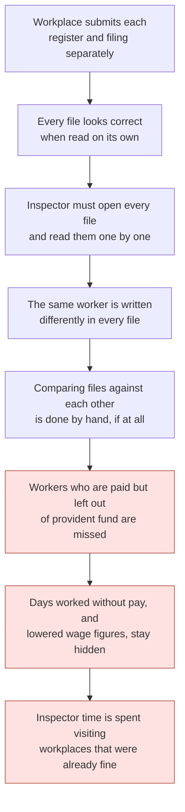
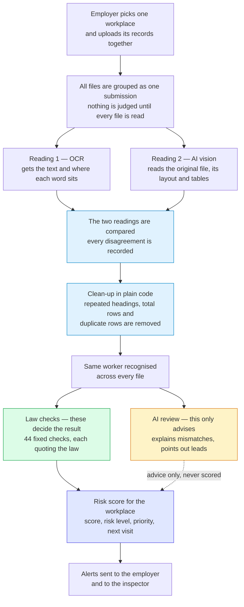
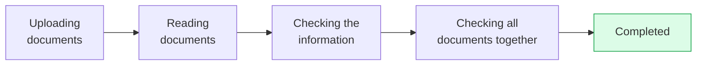
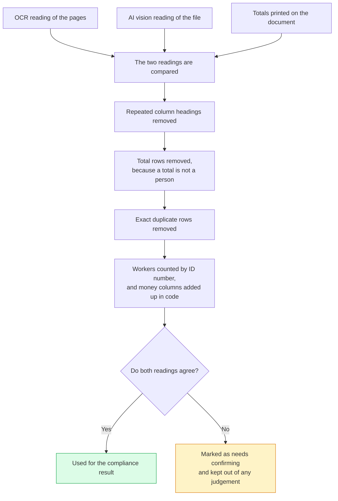
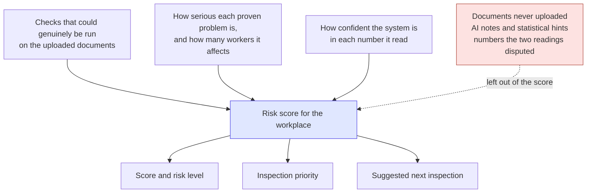

# Shram Drishti

**An AI system that inspects labour compliance documents and scores the risk.**

An employer uploads the wage and attendance records they already keep. Shram Drishti reads them, compares them against each other, checks them against India's four Labour Codes, tells the employer in simple words what is wrong, and gives the inspector a risk score so their time goes where it is actually needed.

I built this for **Digital Shram Sankalp — Reimagining India's Labour Ecosystem with AI**, for problem statement **PS-5, AI-Driven Smart Inspection System for Labour Code Compliance for Shram Suvidha Portal**.

---

## Try it

| | |
|:---|:---|
| **Live application** | **https://shram-drishti.vercel.app/** |
| **Source code** | https://github.com/23110572-hash/Shram-Drishti |
| **Email** | `admin@gmail.com` |
| **Password** | `12345` |

The first request may take a few seconds while the server wakes up.

---

## Demo

---

## The problem

Here is the problem statement as given:

> How can AI-enabled technologies and automated document-reading tools be utilised to enable intelligent document (PDFs, Scanned pdf/ image, Images) analysis, interpret compliances requirements under new labour codes, automatically flags anomalies, discrepancies, missing fields or non- compliance etc. and send automated alerts to employers and inspectors-cum-facilitator. Solution should also be able to generate a risk-based compliance scorecard for establishments.

**In plain words, it asks for four things:**

1. Read the documents employers submit, even when they are scans or phone photos
2. Understand what the new labour laws actually require
3. Automatically spot mistakes, mismatches, blank fields and rule violations
4. Alert the employer and the inspector, and give each workplace a risk score

### Why this is hard today

India merged **29 old central labour laws** into four Labour Codes: the Code on Wages 2019, the Industrial Relations Code 2020, the Code on Social Security 2020, and the Occupational Safety, Health and Working Conditions Code 2020. These decide how every workplace must pay, record and protect its workers.

Compliance is proved with paper. A workplace submits a list of employees, a wage register, an attendance register, wage slips, provident fund and insurance filings, licences and appointment letters. Each file is submitted separately. And read on its own, each file usually looks perfectly fine.

That is exactly where the real problem hides.

A wage register can be perfect on its own while the provident fund filing quietly covers fewer workers than the register pays. An attendance register can show days worked that the wage register never paid for. A filing can be calculated on a lower wage figure than the register itself states.

No single page is wrong. **The violation only exists in the gap between the files.**

So the real challenge was never "read a PDF". It was five hard things at once. The files arrive as clean PDFs, scans and phone photos. The same worker is named differently in each one. What the law demands depends on how many workers there are, what the business does and how risky the work is, so that has to be settled before anything is judged. The serious violations only appear when files are compared. And an inspector's time is the scarcest thing in the whole system, so the output has to be proof, not a guess.

---

## What I built

I built a system that treats every file uploaded for one workplace and one month as **one connected set of evidence**, never as separate files.

An employer picks their workplace, uploads whatever records they have, and Shram Drishti reads every file twice using two separate engines, compares the two readings, recognises the same worker across all the files, runs fixed checks taken straight from the law, tells the employer in ordinary language what was found, gives the workplace a risk score, and alerts both the employer and the inspector.

Every number it reports can be traced back to the exact page it was read from.

---

## How the system works

The most important line in that diagram is the split between the law checks and the AI review. The law side is fixed, repeatable and quotes its source. The AI side only advises and can never change a result or move the score.

---

## One upload, one result

When an employer submits their files, the system groups them into a single submission and waits until **every** file in that group has been read before judging anything.

This matters more than it sounds. Without that wait, the wage register finishes first, the system judges it alone, and the employer is told workers are missing from provident fund before the provident fund filing has even been opened. One group means one honest result.

The employer sees **one progress card for the workplace**, not one card per file.

---

## Every file is read twice

This is the part I care about most, because if a number is read wrong here, it does not stay a wrong number. It becomes an accusation against a real employer.

So each file is read by two engines that never see each other's work. **OCR** reads the pages and also returns where every word sits, which is what later proves a number came from a real place on the page. Separately, an **AI vision model** reads the original file and understands its layout, its wide tables and its column headings, which is what makes messy scans and handwriting usable. A third step then compares the two readings, keeps what they agree on, and writes down every place they disagree.

Two readings catch what one cannot. Registers repeat their column headings on every page, print a total row at the bottom, and split a worker across a page break. Any one of those can be copied down as a person who does not exist. One fake worker is enough to make the headcount disagree with every other file, which then looks like an employer hiding staff.

If the two readings still disagree, the number is **not** guessed. It is flagged for confirmation and left out of the result completely.

I refused one shortcut here on purpose. An earlier version simply took the highest worker count it had seen anywhere. That meant one bad scan could permanently raise a workplace's headcount and switch on legal duties that never applied to it. Now the counts found in documents are shown next to the result, and the employer's own declared details are never quietly overwritten by one shaky reading.

---

## Connecting the files together

Workers are matched across files using their employee number, provident fund number, insurance number and name. So the same person appearing in four different layouts becomes one worker, not four.

That connection is what makes the useful questions answerable:

- Is everyone who was paid also included in the provident fund filing?
- Do the days paid match the days marked present?
- Were extra hours recorded but never paid?
- Is the filing based on a lower wage than the register itself shows?
- Do the worker totals across all the files agree?

Not one of those can be answered from a single file. All of them can be answered once the files are connected.

---

## The law decides, not the AI

Every legal conclusion comes from a fixed set of checks that I wrote directly from the official Code and Rules text. Not from an AI's opinion.

There are **44 checks** across the four Codes. Note that 44 is the number of *checks my system runs*, not a number of laws.

Every check carries the exact section it comes from, who it applies to including worker-count limits, what evidence it needs before it is even allowed to run, a repeatable test, a plain English explanation, and both a passing and a failing example so a check written backwards cannot go live. Everything is tested automatically: **44 checks, 100 test cases, zero errors**.

Writing checks from the real law also meant deleting checks I had already built, once I saw the official wording did not support them.

| What I removed or corrected | Why |
|:---|:---|
| A works committee duty triggered only by worker count | The law makes this duty follow a government order, not a number alone |
| A thirty-day deadline for deciding grievances | The law says the committee *may* finish in that time, not that it must |
| A twelve-hour daily work limit | Replaced with the eight-hour normal working day the Rules actually state |
| Six separate appointment letter problems | Merged into one, because six near-identical rows is noise, not insight |
| Enforcing minimum wage amounts | Kept as advice only, because the actual rates come from state notifications |

A check that accuses a compliant employer is worse than no check at all.

---

## Where the AI stops

I use AI heavily, but never as the judge.

| AI does this | AI never does this |
|:---|:---|
| Reads PDFs, scans and photos | Decides whether the law was broken |
| Understands messy headings and rebuilds tables | Counts the final number of workers |
| Matches differently named columns to one format | Does the arithmetic |
| Explains mismatches in simple English | Picks a legal worker-count limit |
| Points out patterns the checks never covered | Changes how serious something is, or the score |
| Summarises all the files together | Overwrites the employer's declared details |

AI notes are shown as advice and are built to be excluded from the score. A real compliance finding needs a section of law and a repeatable test behind it. An opinion has neither.

---

## Results an employer can act on

Every problem records the file, the page and the exact cell it came from, along with the numbers compared and the section of law used. Problems are shown as a simple numbered list in everyday language, so an employer who has never read a labour law still understands what was found in their own records.

---

## The risk score

The score answers one question: **based on the records actually submitted, how much risk can be seen here?**

A serious violation puts a ceiling on the overall score, so it can never be balanced out by areas that look clean. The score is clearly labelled as covering only the uploaded records, and it comes with an inspection priority and a suggested next visit, so a compliant employer is left alone while an inspector's time goes where the risk really is.

Scores are never edited after they are saved. So a workplace's history over time is real history, not a number quietly changed later.

---

## Automated alerts

As soon as a result is ready, the employer gets a notice explaining what was found and what it is based on, and the inspector gets the risk picture and priority. Only the problems that counted towards the current result are used, so nobody is chased over something old.

---

## How this project answers the problem statement

| What PS-5 asks for | How Shram Drishti delivers it |
|:---|:---|
| Read PDFs, scanned PDFs and images intelligently | Every file is read twice, once by OCR and once by AI vision, then the two readings are compared into one record |
| Understand what the new labour codes require | 44 fixed checks written from the official Code and Rules text, each quoting its exact section and who it applies to |
| Automatically flag mismatches and unusual data | Files are compared against each other, so pay, attendance and filings that disagree are reported |
| Automatically flag missing fields | Required details are checked inside the files that were uploaded, and blank legal fields are reported |
| Automatically flag non-compliance | Clear results, each pointing to the file, page and cell it came from |
| Send automated alerts to employers | A plain-language notice of what was found, sent as soon as the result is ready |
| Send automated alerts to inspectors-cum-facilitators | Risk level, priority and evidence-backed problems delivered to the inspector's worklist |
| Give establishments a risk-based compliance scorecard | Score, risk level, inspection priority and suggested next visit, calculated only from checks that could truly be run |

---

## What this changes

| For | Before | With Shram Drishti |
|:---|:---|:---|
| **Employer** | Finds out about a mistake during or after an inspection | Sees the exact problems in their own records minutes after uploading |
| **Employer** | Legal language they cannot act on | A numbered list in ordinary English, tied to the page it came from |
| **Inspector** | Opens every file and compares numbers by hand | Mismatches between files are surfaced automatically, with proof |
| **Inspector** | No signal for which workplace to visit first | Workplaces ranked by score, priority and suggested next visit |
| **Department** | Compliance judged one file at a time | One workplace and one month judged as a single set of evidence |
| **Worker** | Missing contributions or unpaid days stay invisible | Coverage gaps and unpaid attendance are found by comparison |
| **Trust** | A result nobody can question or verify | Every problem quotes a section of law, a page, and a repeatable test |

---

## The rules I built this by

Reading and explaining is AI's job. Judging and counting is code's job. A number that cannot be traced to a page cannot support a result. All files for one workplace and one month are judged together, never one at a time. A file that was never uploaded means a check could not run, not that a law was broken. Shaky readings are shown, not quietly merged into an employer's record. And every time worker data is opened, it is logged with a reason, because these files hold real people's pay, ID numbers and addresses.

---

## What you will see in the app

The upload screen lets an employer pick or register a workplace, drop the files in, and watch a single progress card run to completion. The result screen gives a plain verdict, the kinds of documents checked, how many checks were run, how many workers were found in the records, and a numbered list of problems. Next to it sits what the AI noticed across the files, in short sentences, clearly marked as advice rather than a verdict. The rules screen lists all 44 checks with the law they come from and a plain English explanation, so nothing about the judgement is hidden. And the worklist ranks workplaces by risk and priority for the inspector.

---

## Built with

React, TypeScript and Tailwind CSS on the front end. Python, FastAPI and PostgreSQL behind it. An OCR engine and an AI vision model for reading documents. Private storage for the uploaded files. And a job queue that survives restarts, so work in progress is never lost.

---

Built by **Krishna** for **Digital Shram Sankalp**, problem statement **PS-5**.

**Live application:** https://shram-drishti.vercel.app/ &nbsp;·&nbsp; **Source code:** https://github.com/23110572-hash/Shram-Drishti
