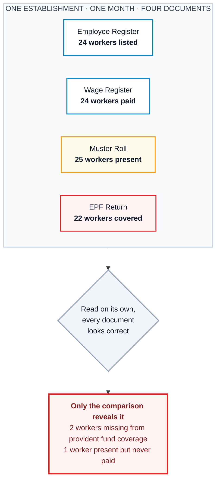
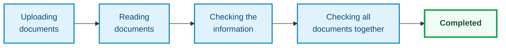
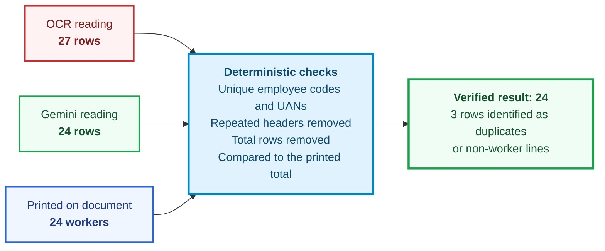
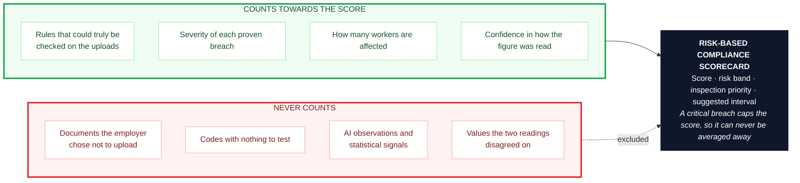

# Shram Drishti

### AI-Driven Smart Inspection System for Labour Code Compliance

**Hackathon:** Digital Shram Sankalp — Reimagining India's Labour Ecosystem with AI

**Problem Statement:** PS-5 — AI-Driven Smart Inspection System for Labour Code Compliance for Shram Suvidha Portal

[**Live Application**](https://shram-drishti.vercel.app/) · [**Source Code**](https://github.com/23110572-hash/Shram-Drishti)

**Login:** `admin@gmail.com` &nbsp;·&nbsp; **Password:** `12345`

---

## Demo

---

## The Problem Statement

> How can AI-enabled technologies and automated document-reading tools be utilised to enable intelligent document (PDFs, Scanned pdf/ image, Images) analysis, interpret compliances requirements under new labour codes, automatically flags anomalies, discrepancies, missing fields or non-compliance etc. and send automated alerts to employers and inspectors-cum-facilitator. Solution should also be able to generate a risk-based compliance scorecard for establishments.

India consolidated twenty-nine labour laws into four Labour Codes: the **Code on Wages 2019**, the **Industrial Relations Code 2020**, the **Code on Social Security 2020**, and the **Occupational Safety, Health and Working Conditions Code 2020**. Together with their Central Rules, these govern how millions of establishments must pay, record and protect their workers.

Compliance is proven with paper. An employer files an employee register, a wage register, a muster roll, wage slips, EPF and ESIC returns, licences, appointment letters and accident records. Every document is filed separately, and read on its own, each one almost always looks correct.

**That is exactly where the real violation hides.**

Today an inspector finds that only by opening every file, tracing the same worker across four different layouts, comparing figures by hand, recalling which threshold applies at which headcount, and writing it up. It does not scale, and it is easy to miss.

**So the real problem is not "read a PDF". It is these five things:**

| # | Challenge |
|---|---|
| 1 | Documents arrive as clean PDFs, scanned pages and phone photographs |
| 2 | The same worker is written differently in every document |
| 3 | Obligations depend on headcount, sector and hazard, so applicability must be settled before anything is judged |
| 4 | The serious violations exist only in the comparison between documents |
| 5 | An inspector's time is the scarcest resource, so the output must be evidence, not guesswork |

---

## What I Built

I built a system that treats every document uploaded for one establishment and one period as **one interconnected body of evidence**, never as separate files.

Upload four or five documents together and Shram Drishti:

1. **Reads every document twice**, independently, and reconciles the two readings
2. **Links the same worker** across all of them
3. **Applies deterministic Labour Code rules** that carry real statutory citations
4. **Reports only what it can prove**, in plain English an employer can act on
5. **Generates a risk-based compliance scorecard**
6. **Sends automated alerts** to the employer and the inspector-cum-facilitator

And it stays honest about its own limits. Every figure traces back to a page. Anything it could not verify is marked unverified instead of asserted.

---

## System Architecture

```mermaid
flowchart TB
    EMP["<b>EMPLOYER</b><br/>Selects one establishment and uploads its<br/>registers, returns, challans and records together"]

    BATCH["<b>ONE ESTABLISHMENT UPLOAD BATCH</b><br/>Assessment waits until every document in the batch has been read"]

    OCR["<b>READING 1 — OCR ENGINE</b><br/>Reads PDFs, scans and images<br/>Returns text plus the position of every word<br/>Word positions become evidence coordinates"]
    GEM["<b>READING 2 — GEMINI VISION</b><br/>Reads the original document directly<br/>Interprets layout, wide tables, column headings<br/>Handles handwriting and poor-quality scans"]

    RECON["<b>RECONCILIATION INTO ONE VERIFIED RECORD</b><br/>Readings compared · duplicate, header and total rows removed<br/>Printed totals re-checked · disagreements recorded<br/><i>Counting and arithmetic happen in code, never in the model</i>"]

    LINK["<b>WORKER IDENTITY LINKING</b><br/>One person recognised across every document<br/>by UAN, ESIC number, employee code and name"]

    RULES["<b>RULE ENGINE — DECIDES COMPLIANCE</b><br/>44 deterministic rules with statutory citations<br/>Thresholds, arithmetic and cross-document checks<br/>Every finding cites document, page and cell"]
    AI["<b>AI REVIEW — ADVISES ONLY</b><br/>Explains contradictions in plain English<br/>Raises leads the rules were never written for<br/>Cannot create a violation or move the score"]

    SCORE["<b>RISK-BASED COMPLIANCE SCORECARD</b><br/>Score · risk band · inspection priority · suggested interval"]

    ALERT["<b>AUTOMATED ALERTS</b><br/>Employer receives what was found and what it rests on<br/>Inspector-cum-facilitator receives the risk picture"]

    INSP["<b>INSPECTOR-CUM-FACILITATOR</b><br/>Risk-ranked establishments and evidence-backed findings"]

    EMP --> BATCH
    BATCH --> OCR
    BATCH --> GEM
    OCR --> RECON
    GEM --> RECON
    RECON --> LINK
    LINK --> RULES
    LINK --> AI
    RULES --> SCORE
    AI -.->|advisory only| SCORE
    SCORE --> ALERT
    ALERT --> INSP

    style EMP fill:#ffffff,stroke:#0284c7,stroke-width:2px,color:#0f172a
    style BATCH fill:#0f172a,stroke:#0f172a,stroke-width:2px,color:#ffffff
    style OCR fill:#ffffff,stroke:#38bdf8,stroke-width:2px,color:#0f172a
    style GEM fill:#ffffff,stroke:#38bdf8,stroke-width:2px,color:#0f172a
    style RECON fill:#e0f2fe,stroke:#0284c7,stroke-width:3px,color:#0c4a6e
    style LINK fill:#eef2ff,stroke:#6366f1,stroke-width:2px,color:#312e81
    style RULES fill:#f0fdf4,stroke:#16a34a,stroke-width:3px,color:#14532d
    style AI fill:#fffbeb,stroke:#f59e0b,stroke-width:2px,color:#78350f
    style SCORE fill:#0f172a,stroke:#0f172a,stroke-width:2px,color:#ffffff
    style ALERT fill:#ffffff,stroke:#0284c7,stroke-width:2px,color:#0f172a
    style INSP fill:#ffffff,stroke:#0284c7,stroke-width:2px,color:#0f172a
```

---

## How It Works

### 1. One upload becomes one assessment

When an employer selects an establishment and submits their documents, I create a single durable upload batch. Every file is attached to it, and the assessment holds at a barrier until **every** document in that batch has finished being read.

This matters more than it sounds. Without the barrier, the wage register finishes first, an assessment runs on it alone, and the employer is told two workers are missing from EPF before the EPF return has even been opened. One batch means one honest result.

The employer sees a single progress card for the establishment, never one card per file:

### 2. Every document is read twice

This is the part I care about most, because extraction accuracy decides everything downstream.

Each document is read by **two independent engines**, and a third pass reconciles them into one strict record while logging every disagreement.

Two readings catch what one cannot. A wage register with 24 workers can easily come back as 27 if a repeated column header, a totals line, or a worker split across a page break is counted as a person. Reading it twice makes that visible instead of silent.

If the two readings still disagree, the value is **not** guessed. It is recorded as needing confirmation and kept out of legal judgement.

I deliberately refused one shortcut here. An earlier version took the highest worker count it saw across all sources, which meant one noisy scan could permanently raise an establishment's headcount and switch on obligations that did not apply to it. Now observed counts are reported beside the result, and the employer's declared profile is never silently overwritten.

### 3. Documents are linked into one picture

Workers are matched across documents using employee code, UAN, ESIC number and name, so the same person appearing in four different layouts becomes one worker.

That linking is what makes the real checks possible:

- Is everyone in payroll present in the EPF return?
- Do the paid days match the days recorded as present?
- Were overtime hours recorded but never paid?
- Is the contribution wage base lower than the wages in the register?
- Do the headcounts across registers and returns agree?

### 4. The law decides compliance, not the AI

Every legal conclusion comes from a deterministic rule pack, which I wrote directly from the official Code and Central Rules text.

There are **44 executable rules** across the four Codes. Each one carries:

- The exact section or rule it comes from
- Who it applies to, including headcount thresholds
- The evidence it needs before it may run at all
- A reproducible test
- A plain English explanation
- Passing and failing fixtures, so a rule written backwards cannot ship

Every rule is validated automatically. **44 rules · 100 fixtures · zero errors.**

I also removed rules instead of keeping them when the official text did not support them:

| Removed or corrected | Why |
|---|---|
| Works Committee triggered purely on headcount | The Code makes it follow a government order |
| A thirty-day grievance deadline | The provision says the committee *may* complete proceedings in that time |
| A twelve-hour daily cap | Replaced with the eight-hour normal working day the Rules actually state |
| Six separate appointment-letter findings | Consolidated into one, because six near-identical rows is noise, not insight |
| Minimum wage enforcement | Kept advisory, because operative rates come from state notifications |

A rule that accuses a compliant employer is worse than no rule at all.

### 5. What the AI is trusted with, and what it is not

I use AI aggressively, but never as the judge.

```mermaid
flowchart TB
    subgraph YES["✅ AI DOES THIS"]
        direction TB
        Y1["Read PDFs, scans and photographs"]
        Y2["Understand messy headings and rebuild tables"]
        Y3["Map differently named columns onto one schema"]
        Y4["Explain contradictions in simple English"]
        Y5["Point out patterns rules were never written for"]
    end

    subgraph NO["⛔ AI NEVER DOES THIS"]
        direction TB
        N1["Decide whether the law was broken"]
        N2["Count the final number of workers"]
        N3["Do the arithmetic"]
        N4["Choose a statutory threshold"]
        N5["Change a severity or move the score"]
    end

    style YES fill:#f0fdf4,stroke:#16a34a,stroke-width:3px,color:#14532d
    style NO fill:#fef2f2,stroke:#dc2626,stroke-width:3px,color:#7f1d1d
    style Y1 fill:#ffffff,stroke:#86efac,color:#14532d
    style Y2 fill:#ffffff,stroke:#86efac,color:#14532d
    style Y3 fill:#ffffff,stroke:#86efac,color:#14532d
    style Y4 fill:#ffffff,stroke:#86efac,color:#14532d
    style Y5 fill:#ffffff,stroke:#86efac,color:#14532d
    style N1 fill:#ffffff,stroke:#fca5a5,color:#7f1d1d
    style N2 fill:#ffffff,stroke:#fca5a5,color:#7f1d1d
    style N3 fill:#ffffff,stroke:#fca5a5,color:#7f1d1d
    style N4 fill:#ffffff,stroke:#fca5a5,color:#7f1d1d
    style N5 fill:#ffffff,stroke:#fca5a5,color:#7f1d1d
```

Model observations appear as advisory notes and are structurally excluded from scoring. A compliance finding needs a citation and a repeatable test, and an opinion has neither.

### 6. Findings an employer can actually act on

Every finding records the document, the page and the exact cell it came from, along with the figures compared and the provision relied on. Problems are shown as a simple numbered list in ordinary language, so an employer who has never read a Labour Code still understands what was found.

### 7. The risk-based compliance scorecard

The score answers one question: **based on the records actually submitted, how much risk is visible here?**

The scorecard is clearly labelled as covering the uploaded records, and it is never presented as a clean bill of health for the whole establishment. It also produces an inspection priority and interval, so a compliant employer is left alone while an officer's time goes where the risk actually is.

Scorecards are immutable, so an establishment's trajectory over time is real history rather than a number quietly restated.

### 8. Automated alerts

Once an assessment completes, the employer receives a notice describing what was found and what it rests on, and the inspector-cum-facilitator receives the risk picture and priority. Only findings that contributed to the current result are used, so nobody is chased over something stale.

---

## Design Principles I Held To

| Principle | What it means in practice |
|---|---|
| **Deterministic core, AI at the edges** | Reading and explaining is AI. Judgement and arithmetic are code. |
| **Evidence or nothing** | A value that cannot be traced to a page cannot support a finding. |
| **Batch-level assessment** | Documents for one establishment and period are judged together, never one at a time. |
| **Absence is not guilt** | A document never uploaded means a check could not run, not that a law was broken. |
| **Nothing is quietly overwritten** | Uncertain readings are surfaced, not merged into an employer's profile. |
| **Everything is logged** | Access to worker records is recorded with a purpose, and the audit trail is tamper-evident. |

---

## What You Will See in the Application

| Screen | What it does |
|---|---|
| **Upload** | Choose or register an establishment, drop the documents in, watch one progress card |
| **Result** | Plain-language verdict, document types checked, rules checked, workers found, numbered list of problems |
| **AI notes** | What the model noticed across the documents, in simple sentences, clearly marked as observations |
| **Rules** | All 44 rules with citations, thresholds and plain English explanations, so nothing about the judgement is hidden |
| **Worklist** | Establishments ranked by risk and inspection priority, for the inspector-cum-facilitator |

---

## Built With

| Layer | Technology |
|---|---|
| **Frontend** | React · TypeScript · Tailwind CSS |
| **Backend** | Python · FastAPI · PostgreSQL |
| **Document reading** | OCR engine · Gemini vision through OpenRouter |
| **Storage** | Private object storage for uploaded documents |
| **Reliability** | A durable job queue, so work survives a restart instead of being lost |

---

## Honest Limitations

I would rather state these than have them discovered.

- Some obligations still wait on **state notifications**, such as current minimum wage rates and certain contribution figures. Those rules stay advisory instead of being enforced on guessed numbers.
- The rules cover what the uploaded document types can prove. Areas such as trade union processes, industrial disputes and maternity benefit need more document schemas before they can be judged fairly.
- No document-reading system is perfect. The goal is not zero error, it is **failing safely**: uncertain values are flagged, never asserted.
- The output supports an inspection. It does not replace an inspector, an authority or legal advice.

## What I Would Build Next

- Bring in state notifications so wage-floor checks can move from advisory to enforceable
- Extend document schemas to unlock the remaining chapters of the Codes
- Worker-level trend analysis across periods, not only within one period
- Inspector feedback on findings, feeding back into rule precision

---

**Shram Drishti** · Built for **Digital Shram Sankalp** · Problem Statement **PS-5**

[Live Application](https://shram-drishti.vercel.app/) · [Source Code](https://github.com/23110572-hash/Shram-Drishti)

